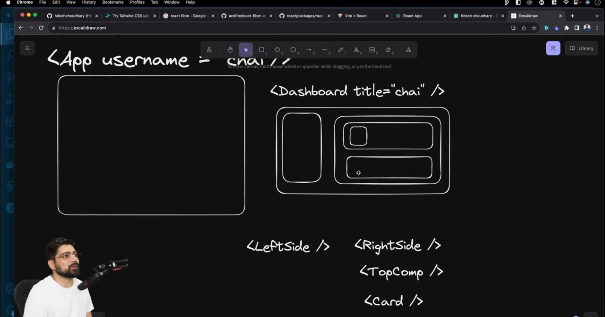
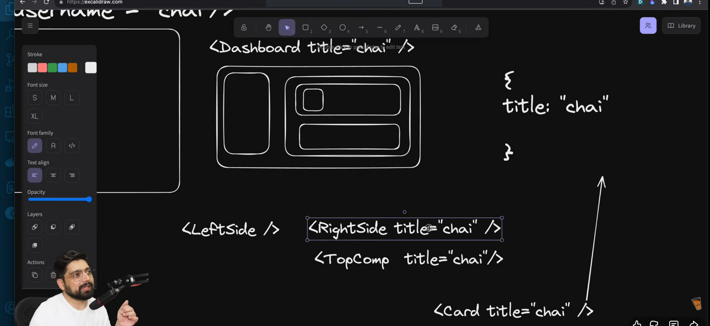
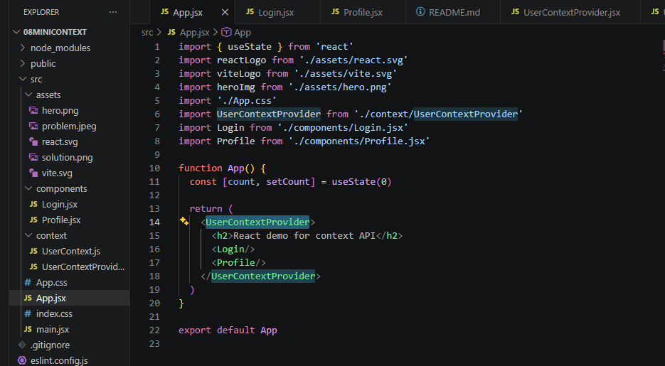

# Notes for Context API

## Problem:



{title} prop will be passed to RightSIde, TopCOmp & then to Card components.
But RightSide, TopComp dont need the data for {title}.

## Solution: useContext()



Idea is to create a global variable/file in which the required data will be stored & then accessed by components.
COmes under COntext API - Library


## Steps to create context: Ex. UserContext

1. Part 1 
- Create a folder named context in /src
- UserContext.js file inside it.
- React.createContext() -> export it

Every context provides a Provider.
AT the end we will wrap all components within the UserCOntext created.

i.e 
   
```
    <UserContext>
        <Login></Login>
        <data>
    <UserContext/>
```

All components will have access of UserContext.

2. Part - 2

Create Provider - 2 ways

Way 1:
- Create USerContextProvider.jsx file 

```
import React, { useState } from "react";
import UserContext from "./UserContext";

const UserContextProvider = ({children}) => {
    const [user, setUser] = useState(null)
    return (
        <UserContext.Provider value={user, setUser}>
            {children}
        </UserContext.Provider>
    )
}

export default UserContextProvider;
```

- Now we will have to give access of this provider to those who will use it.
(Import the provider)

- Import useContext & use it in the below way: 

```
import React, {useState, useContext} from 'react'
import UserContext from '../context/UserContext'

function Login() {
  const [username, setUsername] = useState('')
  const [password, setPassword] = useState('')

  // setUser from context is referenced here
  const {setUser} = useContext(UserContext)

  const HandleSubmit = (e) => {
    e.preventDefault()
    setUser({username, password})
  }
  return (
    <div>
      <h2>Login</h2>
      <input type='text' value={username} onChange={(e) => {
        setUsername(e.target.value)
      }} placeholder='username'/>
      <br></br>
      <input type='text' value={password} onChange={(e) => {
        setPassword(e.target.value)
      }} placeholder='password'/>
      
      <button onClick={HandleSubmit}>Submit</button>
    </div>
  )
}

export default Login
```

3. Part - 3

How to use the provider to pass values/hooks

